# Kết quả đạt được: sau khi sử dụng cross validation thì kết quả cho được đạt 93,3 % đối với sử dụng dữ liệu vỏn vẹn 100 file. Với mỗi file là 3s

# phân tích các tính năng được chọn.

# 1.Miền Thời Gian.

1.1. zcr (zeros crossing rate)

- đây được được định nghĩa tỉ lệ vượt qua số 0 của 1 tín hiệu.
  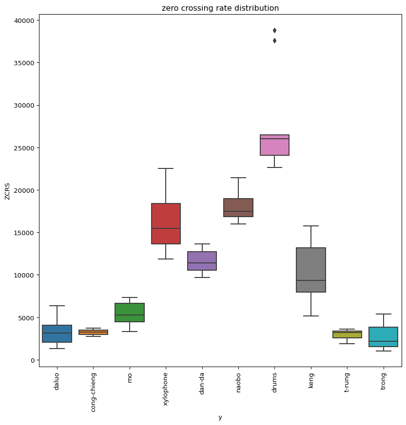
  nhìn vào biểu đồ phân phối zcr của các nhạc cụ thì ta có thể nhận xét rằng các nhạc cụ có sự phân phối khác nhau.
  
vậy nên ta có thể rút ra được kết luận zcr có sự ảnh hưởng lớn đến việc nhận dạng nhạc cụ gõ.

1.2. AE (amplitude envelope).

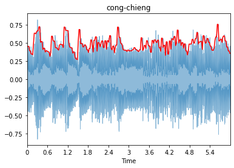

tính năng này là tính năng lấy tín hiện lớn nhất của mỗi farme.

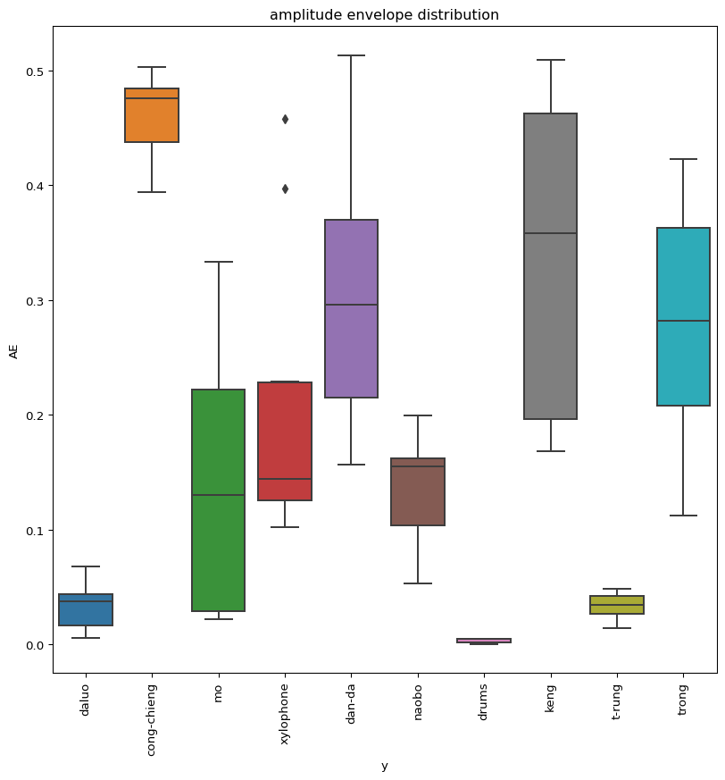

cũng giống như zcr thì ta thấy AE có sự ảnh hưởng khá là mạnh đến nhận dạng nhạc cụ là các phân phối của chúng có sự
khác nhau.

# 2.Phân Tích Miền Tần số.

Phân Tích biểu đồ trung bình tần số .

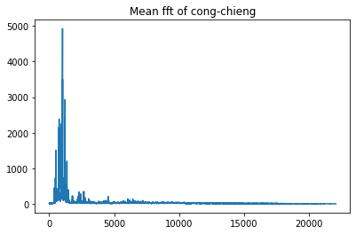
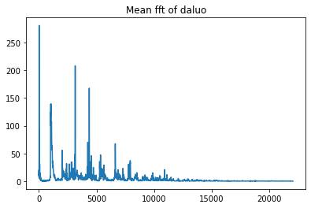
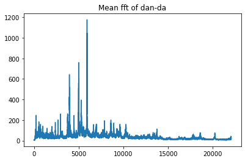
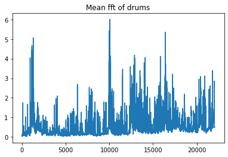
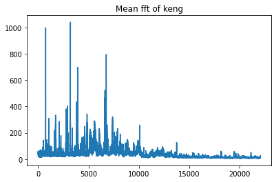
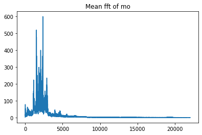
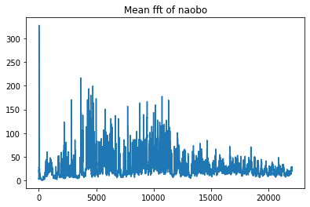
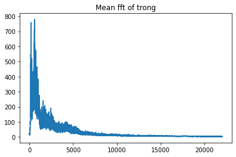

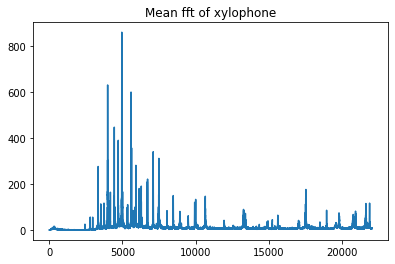

Nhìn vào biểu đồ trung bình biên độ của tần số ta nhận có điểm khác nhau rất lớn giữa các nhạc cụ gõ. vị như cồng chiên
thì trung bình biên độ tập trung chủ yếu vào năm tần số thấp. Nhưng drums thì ngược lại trung bình biên độ lại giải đều
. Vậy nên đây là 1 tính năng cực kì tốt để chúng ta khai thác.

Nhưng điều làm chúng ta rất khó khăn đó là việc giải tần số của con người quá rộng. vậy nên tiểu luận xin đề xuất sử
dụng các vùng tần số mình sẽ đi lấy trung bình biên độ tần sô của vùng tần số này để giảm chiều giữa liệu. do các nhạc
cụ đều có biên độ cao ở miền tần số thấp và cũng do tai con người nhạy cảm với vùng tần số thấp nên tiểu luận quyết định
các vùng tần số thấp sẽ lấy không rộng nhưng càng lên cao càng rổng ra. các vùng tần số mà tiểu luận xin được đề xuất
là:

- 20:22
- 22:25
- 25:30
- 30:40
- 40:50
- 50:60
- 70:80
- 80:90
- 100:120
- 120:140
- 140:160
- 160:180
- 180:200
- 200:250
- 250:300
- 300:350
- 350:400
- 400:450
- 450:500
- 500:600
- 600:700
- 700:800
- 800:1000
- 1000:1200
- 1200:2000
- 2000:3000
- 3000:4000
- 4000:7000
- 7000:15000
- 15000: 22100

# 3. Run Hệ Thống.

bước 1: cài đặt file requirements.txt

pip instal -r requirements.txt

bước 2 chạy file main.py

python3 main.py 

# 4. Kết quả đạt được:
sau khi sử dụng cross validation thì kết quả cho được đạt 93,3 % đối với sử dụng dữ liệu vỏn vẹn 100 file. Với mỗi file là 3s
